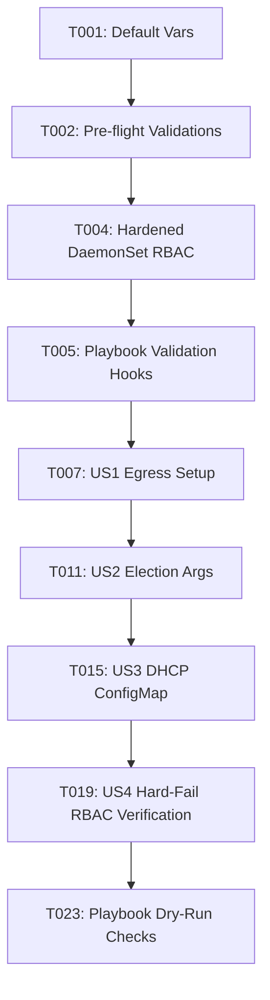

# Tasks: Kube-VIP Egress and HA Hardening

**Input**: Design documents from `specs/006-kube-vip-hardening/`

**Prerequisites**: [plan.md](plan.md) (required), [spec.md](spec.md) (required for user stories), [research.md](research.md)

**Tests**: Test validation tasks included as requested by the specification/runbook validations.

**Organization**: Tasks grouped by user story to enable independent implementation and testing.

## Format: `[ID] [P?] [Story] Description`

- **[P]**: Can run in parallel (different files, no dependencies)
- **[Story]**: Which user story this task belongs to (e.g., US1, US2, US3, US4)

---

## Phase 1: Setup (Shared Infrastructure)

**Purpose**: Project initialization and base configurations

- [x] T001 Define configuration variables for egress, election, and DHCP in [ansible/roles/kube-vip/defaults/main.yml](ansible/roles/kube-vip/defaults/main.yml) and global environment variables in [ansible/group_vars/all.yml](ansible/group_vars/all.yml)
- [x] T002 Add pre-flight asset/variable validations in [ansible/roles/kube-vip/tasks/install.yml](ansible/roles/kube-vip/tasks/install.yml)
- [x] T003 Configure token-optimized execution defaults in [.github/copilot-instructions.md](.github/copilot-instructions.md) and [.specify/memory/constitution.md](.specify/memory/constitution.md)

---

## Phase 2: Foundational (Blocking Prerequisites)

**Purpose**: Core RBAC and playbook hooks that must exist before implementing functional behaviors

- [x] T004 Review, expand, and enforce required API permissions for kube-vip in [ansible/roles/kube-vip/templates/kube-vip-daemonset.yaml.j2](ansible/roles/kube-vip/templates/kube-vip-daemonset.yaml.j2)
- [x] T005 Setup pipeline verification task in [ansible/roles/kube-vip/tasks/install.yml](ansible/roles/kube-vip/tasks/install.yml) to run local dry-run validation of applied templates
- [x] T006 [P] Update Kube-VIP Cloud Provider RBAC definition in [ansible/roles/kube-vip/templates/kube-vip-cloud-controller.yaml.j2](ansible/roles/kube-vip/templates/kube-vip-cloud-controller.yaml.j2)

**Checkpoint**: Foundation ready - functional user story implementation can begin

---

## Phase 3: User Story 1 - Standardize Egress Through Kube-VIP (Priority: P1) 🎯 MVP

**Goal**: Configure and enforce default-on kube-vip egress mapping with explicit workload/namespace opt-out.

**Independent Test**: Enable egress mode, deploy a test workload without annotations (reaches egress IP), and a test workload with `kube-vip.io/egress: "false"` (reaches default node IP).

### Implementation for User Story 1

- [x] T007 Configure egress container flags in [ansible/roles/kube-vip/templates/kube-vip-daemonset.yaml.j2](ansible/roles/kube-vip/templates/kube-vip-daemonset.yaml.j2) based on egress variables
- [x] T008 [P] Document egress validation commands and opt-out annotations in [specs/006-kube-vip-hardening/quickstart.md](specs/006-kube-vip-hardening/quickstart.md)
- [x] T009 [P] Update egress routing and network policy configuration examples in [docs/kube-vip-configuration.md](docs/kube-vip-configuration.md)
- [x] T010 Add egress verification tasks to playbooks in [ansible/playbooks/cluster-core.yml](ansible/playbooks/cluster-core.yml)

**Checkpoint**: User Story 1 egress handling functional and testable on a live cluster

---

## Phase 4: User Story 2 - Enable HA Service Election (Priority: P1)

**Goal**: Enable Kube-VIP HA service election mode to coordinate active LoadBalancer announcements.

**Independent Test**: Terminate the active service leader and verify peer node resumes service advertisement within recovery thresholds.

### Implementation for User Story 2

- [x] T011 Update DaemonSet leader election arguments in [ansible/roles/kube-vip/templates/kube-vip-daemonset.yaml.j2](ansible/roles/kube-vip/templates/kube-vip-daemonset.yaml.j2)
- [x] T012 Configure service-election options in [ansible/roles/kube-vip/defaults/main.yml](ansible/roles/kube-vip/defaults/main.yml)
- [x] T013 Verify service-election arguments match official spec within [ansible/roles/kube-vip/tasks/install.yml](ansible/roles/kube-vip/tasks/install.yml)
- [x] T014 [P] Update HA service election instructions in [specs/006-kube-vip-hardening/quickstart.md](specs/006-kube-vip-hardening/quickstart.md)

**Checkpoint**: User Stories 1 and 2 functional and stable

---

## Phase 5: User Story 3 - Support Optional DHCP-Based LoadBalancer (Priority: P1)

**Goal**: Support environment-wide DHCP LoadBalancer addressing via Cloud Provider CIDR range `0.0.0.0/32` or direct DHCP variables.

**Independent Test**: Provision a LoadBalancer service with DHCP enabled and verify dynamic address assignment occurs consistently.

### Implementation for User Story 3

- [x] T015 Support `0.0.0.0/32` IP ConfigMap structure in [ansible/roles/kube-vip/templates/kube-vip-configmap.yaml.j2](ansible/roles/kube-vip/templates/kube-vip-configmap.yaml.j2) when DHCP mode is enabled
- [x] T016 Add dynamic DHCP lease check logic in Cloud Provider template [ansible/roles/kube-vip/templates/kube-vip-cloud-controller.yaml.j2](ansible/roles/kube-vip/templates/kube-vip-cloud-controller.yaml.j2)
- [x] T017 Integrate DHCP-enabled checks inside validation playbook tasks in [ansible/roles/kube-vip/tasks/install.yml](ansible/roles/kube-vip/tasks/install.yml)
- [x] T018 [P] Document DHCP address verification procedures in [specs/006-kube-vip-hardening/quickstart.md](specs/006-kube-vip-hardening/quickstart.md)

**Checkpoint**: Kube-VIP DHCP and IPPool allocated services co-exist stably

---

## Phase 6: User Story 4 - Harden and Verify Kube-VIP RBAC Bindings (Priority: P1)

**Goal**: Establish mandatory hard-fail RBAC validation gates to reject missing cluster permissions.

**Independent Test**: Simulate missing RBAC permission during verification and assert Ansible task failure occurs as a deployment blocker.

### Implementation for User Story 4

- [x] T019 Implement hard-fail RBAC verification lookup in [ansible/roles/kube-vip/tasks/install.yml](ansible/roles/kube-vip/tasks/install.yml) to assert presence of essential API permissions
- [x] T020 Run complete RBAC validation checks using `kube-vip` serviceaccount impersonation
- [x] T021 [P] Document RBAC debugging steps and permission audit command sequences in [specs/006-kube-vip-hardening/quickstart.md](specs/006-kube-vip-hardening/quickstart.md)

---

## Phase 7: Polish & Cross-Cutting Concerns

**Purpose**: Operational validation and runbooks alignment

- [x] T022 Document full cluster failure-scenario drills (split-brain, DHCP timeout) in [docs/ansible-k3s-baseline.md](docs/ansible-k3s-baseline.md)
- [x] T023 Perform complete inventory validation and Ansible dry-run syntax verification using `rtk ansible-playbook --check` on [ansible/playbooks/site.yml](ansible/playbooks/site.yml)

### Egress Service Automation Alignment

- [x] T024 [US1] Render workload LoadBalancer Service manifests from `kube_vip_services` in [ansible/roles/kube-vip/templates/kube-vip-services.yaml.j2](ansible/roles/kube-vip/templates/kube-vip-services.yaml.j2)
- [x] T025 [US1] Apply rendered kube-vip service manifests automatically in [ansible/roles/kube-vip/tasks/install.yml](ansible/roles/kube-vip/tasks/install.yml) when LB mode is enabled
- [x] T026 [P] [US1] Define cluster-scoped `kube_vip_services` inventory configuration in [ansible/group_vars/all.yml](ansible/group_vars/all.yml)
- [x] T027 [P] [US1] Update operator runbooks to remove manual Service deployment steps and document variable-driven playbook application in [docs/kube-vip-configuration.md](docs/kube-vip-configuration.md) and [ansible/roles/kube-vip/README.md](ansible/roles/kube-vip/README.md)

---

## Dependencies & Completion Graph

## Parallel Execution Opportunities

- T003 (Token-optimized default settings) can run concurrently with Phase 2 Setup
- T008 (Egress user docs), T009 (Egress architecture docs), and T010 (Integration playbooks) can be authored in parallel
- T014 (HA service election docs) is independent of US2 daemonset config updates
- T018 (DHCP verification docs) is independent of US3 cloud-provider integrations
- T021 (RBAC diagnostic docs) is independent of US4 verification automation
